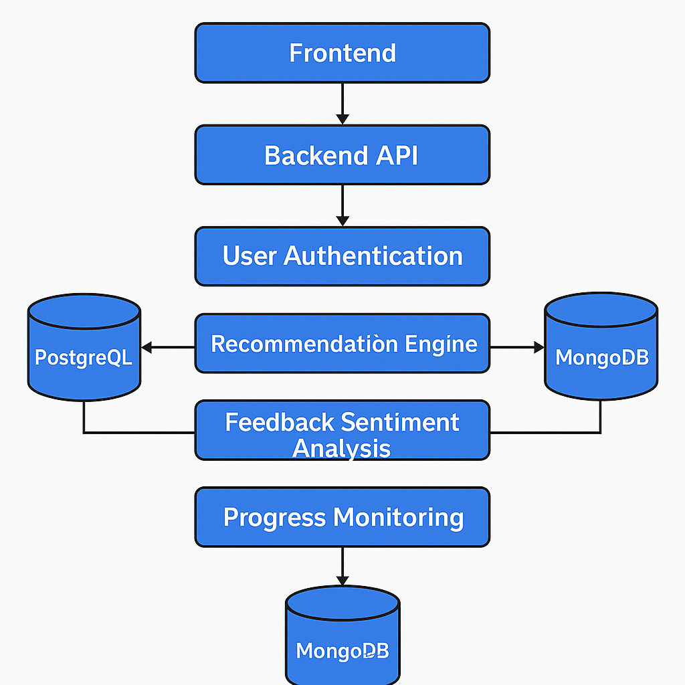
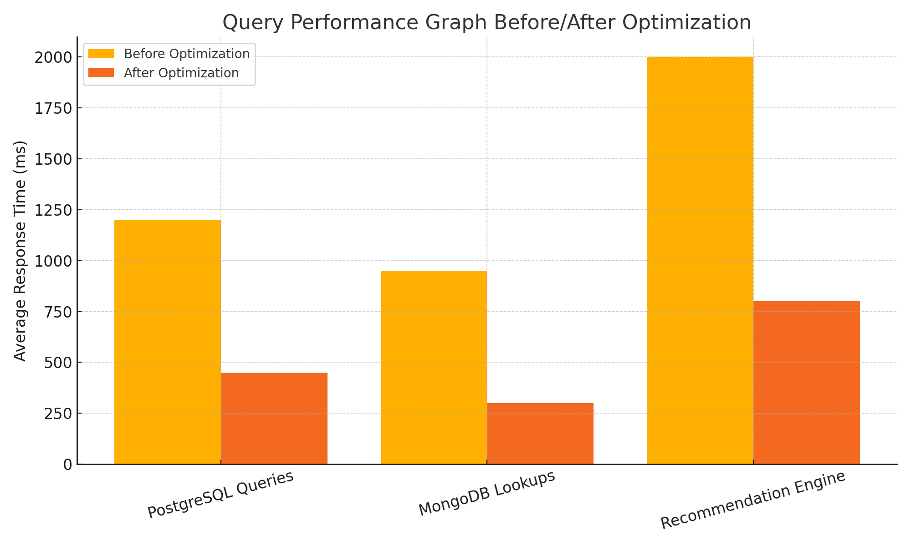
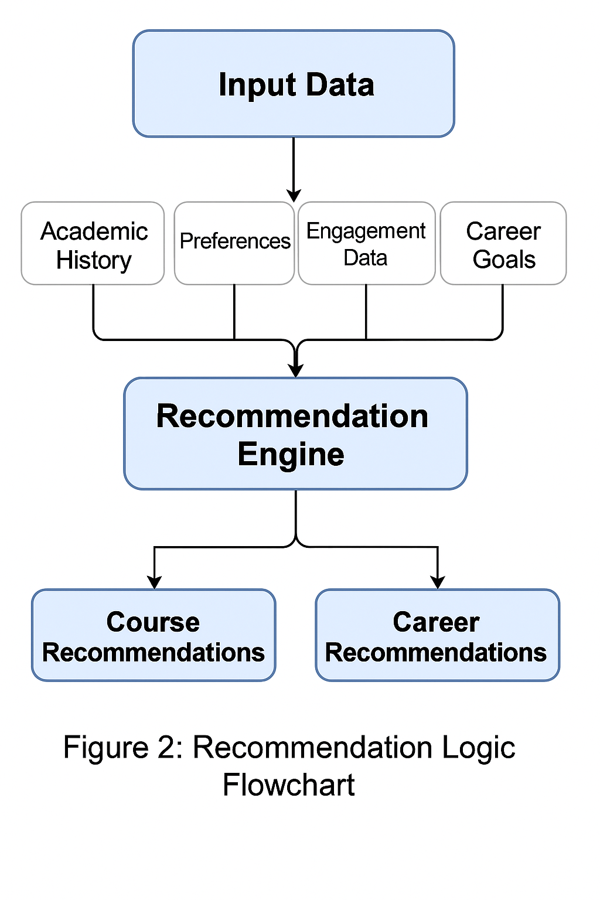

# 🎓 AI Academic Advisor

> **Empowering Students with AI-Driven Academic Insights and Personalized Guidance**

[](https://www.youtube.com/watch?v=EvGvcQq2ZGo)

## 📋 Table of Contents

- [Overview](#overview)
- [✨ Key Features](#-key-features)
- [🏗️ Architecture](#️-architecture)
- [🛠️ Technology Stack](#️-technology-stack)
- [🚀 Getting Started](#-getting-started)
- [📊 Project Structure](#-project-structure)
- [🎯 Core Functionalities](#-core-functionalities)
- [📈 Data & Analytics](#-data--analytics)
- [🤖 AI Components](#-ai-components)
- [📱 Screenshots](#-screenshots)
- [🔧 API Documentation](#-api-documentation)
- [📚 Documentation](#-documentation)
- [🤝 Contributing](#-contributing)
- [📄 License](#-license)

## Overview

The **AI Academic Advisor** is an intelligent system designed to revolutionize academic guidance by providing personalized recommendations, career path insights, and data-driven decision support for both students and educators. Built with modern web technologies and powered by AI, this platform offers a comprehensive solution for academic success.

### 🎯 Mission
To enhance student success through personalized AI-driven academic guidance, career path optimization, and data-informed educational decisions.

## ✨ Key Features

### 🎓 **Personalized Academic Recommendations**
- **Smart Course Suggestions**: AI-powered course recommendations based on academic history, learning style, and career goals
- **Study Plan Optimization**: Personalized study plans that adapt to individual learning pace and objectives
- **Skill Gap Analysis**: Identify and address knowledge gaps with targeted learning resources

### 🚀 **Career Path Guidance**
- **Career Path Mapping**: Suggest potential career trajectories based on academic performance and interests
- **Skill Development Roadmap**: Personalized skill-building recommendations for career advancement
- **Industry Alignment**: Connect academic achievements with real-world career opportunities

### 📊 **Data-Driven Insights**
- **Performance Analytics**: Comprehensive academic performance tracking and analysis
- **Predictive Modeling**: Early identification of at-risk students with intervention recommendations
- **Trend Analysis**: Educational pattern recognition for institutional decision-making

### 💬 **Intelligent Chat Interface**
- **AI-Powered Conversations**: Natural language interaction for academic guidance
- **Contextual Responses**: Personalized advice based on student profile and history
- **Real-time Support**: Instant access to academic resources and recommendations

### 🔄 **Adaptive Learning System**
- **Continuous Improvement**: Self-learning AI that adapts to student feedback and outcomes
- **Dynamic Recommendations**: Real-time adjustment of suggestions based on progress
- **Personalized Interventions**: Proactive support for struggling students

## 🏗️ Architecture

```
┌─────────────────┐    ┌─────────────────┐    ┌─────────────────┐
│   Frontend      │    │   Backend       │    │   AI Services   │
│   (React)       │◄──►│   (Node.js)     │◄──►│   (OpenAI)      │
└─────────────────┘    └─────────────────┘    └─────────────────┘
         │                       │                       │
         │                       │                       │
         ▼                       ▼                       ▼
┌─────────────────┐    ┌─────────────────┐    ┌─────────────────┐
│   UI Components │    │   REST APIs     │    │   ML Models     │
│   - Dashboard   │    │   - Students    │    │   - XGBoost     │
│   - Chat        │    │   - Courses     │    │   - Analytics   │
│   - Profile     │    │   - Performance │    │   - Predictions │
└─────────────────┘    └─────────────────┘    └─────────────────┘
```

## 🛠️ Technology Stack

### Frontend
- **React 19** - Modern UI framework with TypeScript
- **Material-UI (MUI)** - Professional component library
- **React Router** - Client-side routing
- **Emotion** - CSS-in-JS styling

### Backend
- **Node.js** - Server-side JavaScript runtime
- **Express.js** - Web application framework
- **MongoDB** - NoSQL database with Mongoose ODM
- **Flask** - Python web framework for AI services

### AI & Machine Learning
- **OpenAI GPT-4** - Natural language processing
- **XGBoost** - Gradient boosting for predictions
- **Pandas & NumPy** - Data manipulation and analysis
- **Scikit-learn** - Machine learning algorithms

### Data & Analytics
- **CSV Datasets** - Student performance data
- **Course Catalogs** - Educational content
- **Performance Metrics** - Academic analytics

## 🚀 Getting Started

### Prerequisites
- Node.js (v16 or higher)
- Python 3.8+
- MongoDB
- OpenAI API Key

### Installation

1. **Clone the repository**
   ```bash
   git clone https://github.com/yourusername/AI-Academic-Advisor.git
   cd AI-Academic-Advisor
   ```

2. **Frontend Setup**
   ```bash
   cd Frontend
   npm install
   npm start
   ```

3. **Backend Setup**
   ```bash
   cd Backend/Database
   npm install
   npm start
   ```

4. **AI Services Setup**
   ```bash
   cd Backend/Chatboard
   pip install -r requirements.txt
   python app.py
   ```

5. **Environment Configuration**
   ```bash
   # Create .env file in Backend/Chatboard/
   OPENAI_API_KEY=your_openai_api_key_here
   ```

### Running the Application

1. **Start the Backend Server** (Port 5000)
   ```bash
   cd Backend/Database
   npm start
   ```

2. **Start the AI Chat Service** (Port 5001)
   ```bash
   cd Backend/Chatboard
   python app.py
   ```

3. **Start the Frontend** (Port 3000)
   ```bash
   cd Frontend
   npm start
   ```

4. **Access the Application**
   - Frontend: http://localhost:3000
   - Backend API: http://localhost:5000
   - AI Chat: http://localhost:5001

## 📊 Project Structure

```
AI-Academic-Advisor/
├── Frontend/                 # React TypeScript Application
│   ├── src/
│   │   ├── components/      # Reusable UI Components
│   │   ├── pages/          # Main Application Pages
│   │   ├── data/           # Static Data Files
│   │   └── assets/         # Images and Icons
│   └── public/             # Static Assets
├── Backend/
│   ├── Database/           # Node.js Express Server
│   │   ├── models/         # MongoDB Schemas
│   │   ├── routes/         # API Endpoints
│   │   ├── controllers/    # Business Logic
│   │   └── config/         # Database Configuration
│   ├── Chatboard/          # Python Flask AI Service
│   └── Datasets Management/# Data Collection & Processing
├── Documentation/           # Project Documentation
└── README.md              # This File
```

## 🎯 Core Functionalities

### 1. **Student Dashboard**
- Academic performance tracking
- Course recommendations
- Career path suggestions
- Skill assessment tools

### 2. **AI Chat Interface**
- Natural language academic guidance
- Personalized recommendations
- Real-time support and resources

### 3. **Course Management**
- Course catalog integration
- Prerequisite tracking
- Learning path optimization

### 4. **Performance Analytics**
- GPA tracking and trends
- Subject-wise performance analysis
- Predictive performance modeling

### 5. **Career Guidance**
- Career path recommendations
- Skill gap analysis
- Industry alignment suggestions

## 📈 Data & Analytics

### Datasets Used
- **CS Students Dataset**: 181 student records with academic performance
- **Course Catalogs**: Educational content from various institutions
- **Performance Metrics**: Historical academic data for predictions

### Analytics Features
- **Predictive Modeling**: XGBoost-based performance prediction
- **Trend Analysis**: Academic pattern recognition
- **Risk Assessment**: Early identification of struggling students

## 🤖 AI Components

### Natural Language Processing
- **OpenAI GPT-4 Integration**: Advanced conversational AI
- **Contextual Understanding**: Personalized responses based on student profile
- **Multi-turn Conversations**: Sustained academic guidance sessions

### Machine Learning Models
- **XGBoost Classifier**: Academic performance prediction
- **Recommendation Engine**: Course and career suggestions
- **Anomaly Detection**: Identifying at-risk students

### Data Processing
- **Feature Engineering**: Academic metrics transformation
- **Data Validation**: Quality assurance for student data
- **Real-time Processing**: Dynamic recommendation updates

## 📱 Screenshots

### Dashboard Interface


### Performance Analytics


### Recommendation System


## 🔧 API Documentation

### Student Endpoints
```http
GET    /api/students          # Get all students
POST   /api/students          # Create new student
GET    /api/students/:id      # Get student by ID
PUT    /api/students/:id      # Update student
DELETE /api/students/:id      # Delete student
```

### Course Endpoints
```http
GET    /api/courses           # Get all courses
POST   /api/courses           # Create new course
GET    /api/courses/:id       # Get course by ID
PUT    /api/courses/:id       # Update course
DELETE /api/courses/:id       # Delete course
```

### Performance Endpoints
```http
GET    /api/performance       # Get performance data
POST   /api/performance       # Add performance record
GET    /api/performance/:id   # Get performance by ID
```

### Chat Endpoints
```http
POST   /chat                  # Send message to AI
```

## 📚 Documentation

- **Capstone Report**: [AI Academic Advisor Report](Documentation/Capstone%20Report%20-%20AI%20Academic%20Advisor.pdf)
- **Project Poster**: [Detailed Project Poster](Documentation/Project%20detailed%20Poster.pdf)
- **Presentation**: [PowerPoint Presentation](Documentation/AI%20Academic%20Advisor%20Empowering%20Students%20with%20AI-Driven%20Insights.pptx)

## 🤝 Contributing

We welcome contributions! Please follow these steps:

1. Fork the repository
2. Create a feature branch (`git checkout -b feature/AmazingFeature`)
3. Commit your changes (`git commit -m 'Add some AmazingFeature'`)
4. Push to the branch (`git push origin feature/AmazingFeature`)
5. Open a Pull Request

### Development Guidelines
- Follow TypeScript best practices
- Maintain consistent code formatting
- Write comprehensive tests
- Update documentation for new features

## 📄 License

This project is licensed under the MIT License - see the [LICENSE](LICENSE) file for details.

---

## 🎓 Project Team

**Developed as a Capstone Project**  
*Empowering the future of education through AI-driven academic guidance*

---

<div align="center">

**⭐ Star this repository if you find it helpful!**

[](https://github.com/yourusername/AI-Academic-Advisor)
[](https://github.com/yourusername/AI-Academic-Advisor)
[](https://github.com/yourusername/AI-Academic-Advisor/issues)

</div>

